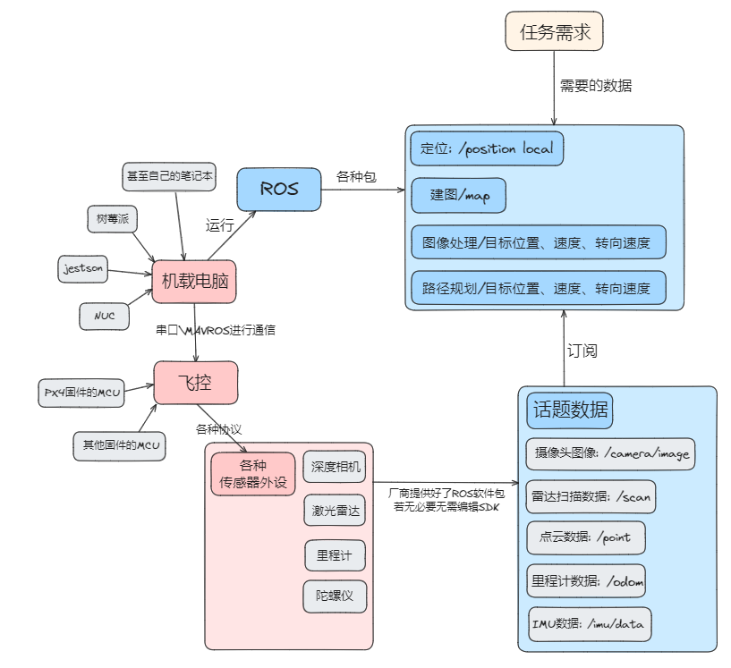

# PX4-ROS-LEARNING

## 参考链接

这里是 PX4 官方文档的资料
- [使用 PX4-SDK 来控制 PX4](https://docs.px4.io/main/zh/modules/hello_sky.html)
	- [针对不同平台编译 PX4 代码](https://docs.px4.io/main/zh/dev_setup/building_px4.html#gazebo-classic)
- [编写 ROS 包通过 MAVROS 控制 Offboard 模式的 PX4](https://docs.px4.io/main/zh/ros/mavros_offboard_cpp.html)
	- [PX4-ROS-Gazebo 联合仿真](https://docs.px4.io/main/zh/simulation/ros_interface.html)

## 从零开始的 PX4-ROS 之旅

因为 PX4 的 SDK 会随着版本变化而更新，实际上我们在开发的时候应该**不是直接使用 SDK**，而是参考 SDK 做好的 **MAVROS 通信接口来进行 ROS 软件包的开发**，所以重点关注的就是如何使用 MAVROS 来控制 PX4 了

下面是是 ROS 无人机项目的大概框图，当我们在使用一个 ROS 无人机项目时，最好能大概知道项目的各个节点中有话题和服务在传递，各个节点是怎么协作的，这样我们就可以更好地理解整个项目的结构，然后在后续进行魔改



这需要我们重点关注运行项目时，项目提供的 `launch` 文件，这些文件里面包含了各个节点甚至是各个模块的启动顺序，可以是我们了解一个项目的入口

然后在运行项目时，我们可以通过善用 ROS 终端工具来查看项目的节点之间的关系、发布的话题消息、服务有哪些（对于终端工具有个印象即可，不必记 api，但是要想起来要理清项目结构需要获取那些信息，然后去查对应的命令）


## 编写 PX4-ROS 软件包的注意事项

## 进行 ROS-PX4 仿真的启动顺序

```shell
cd <PX4-Autopilot_clone>
DONT_RUN=1 make px4_sitl_default gazebo-classic

source Tools/simulation/gazebo-classic/setup_gazebo.bash $(pwd) $(pwd)/build/px4_sitl_default

export ROS_PACKAGE_PATH=$ROS_PACKAGE_PATH:$(pwd)
export ROS_PACKAGE_PATH=$ROS_PACKAGE_PATH:$(pwd)/Tools/simulation/gazebo-classic/sitl_gazebo-classic

roslaunch mavros px4.launch fcu_url:="udp://:14540@192.168.1.36:14557"
roslaunch px4 posix_sitl.launch
```

## P.S

大家可以都去申请 github 学生包，可以用 VScode 在工作区或者文件内内联使用 o1-preview 但是这个需要进行身份信息的补完
- 2 FA
- authorization 令牌
- 学信网学生证明（deepl 翻译成英文）
- 学校邮箱
- 邮政编码


